# Clawd Büyücü

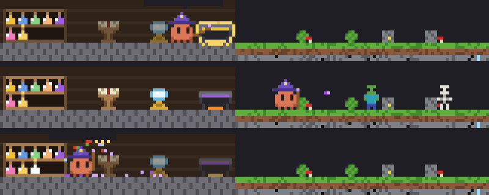

Claude çalışırken istem satırının hemen üstünde küçük bir piksel Minecraft sahnesi açılır.
Clawd'un elinde büyücü asası var. Düşünürken dışarıda canavarlara büyü atıp malzeme toplar.
Okurken büyü kitabını çevirir. Düzenlerken kazanda iksir karıştırır ve her iksiri arkasındaki dolaba koyar.
Dolap oturumlar arasında saklanır, yani Claude ne kadar iş çıkarırsa raflar o kadar dolar.

Bu bir [Claude Code mod](https://code.claude.com/docs/en/plugins/mods/overview)'udur. LLM çağırmaz, ağ kullanmaz;
arazi tohumlu ve deterministiktir.

## Claude ne yapıyorsa sahne ona döner

| Claude | Sahnede | Balon |
|---|---|---|
| Düşünüyor | Araziye yürür; zombi, iskelet, örümcek ve slime'a büyü atar, düşen kemiği, mantarı, çiçeği toplar | `düşünüyor…` |
| Read / Grep / Glob | Kürsüdeki büyü kitabının sayfalarını çevirir | `README.md'yi okuyor` |
| Edit / Write | Kazanı karıştırır, dosya türünün renginde bir şişe doldurup dolaba koyar | `sahne.js'yi karıştırıyor` |
| WebFetch / WebSearch | Kristal küreye bakar, kürede bulutlar döner | `kürede: github.com` |
| Bash | Asadan kıvılcımla TNT'yi tutuşturur, kalkan açar; komut bitince TNT patlar | `npm test patlatıyor` |
| Agent | Portaldan renkli şapkalı bir çırak çıkar ve işe katılır; ajan bitince geri döner | `çırak: testleri yaz` |
| Araç hata verdi | Creeper gelir, büyü tutukluk yapar, Clawd savrulur, şapkası uçar | `Eyvah, büyü tutmadı!` |
| Tur bitti | Dolabın önünde asadan havai fişek; bu turda eklenen şişeler sırayla parlar | `Bitti! 3 iksir hazır` |

**Düşünürken:** canavar avı ve malzeme toplama

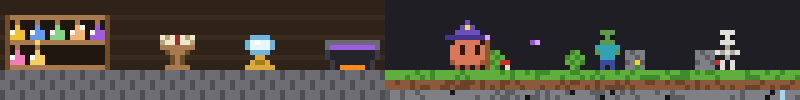

**Okurken:** büyü kitabı

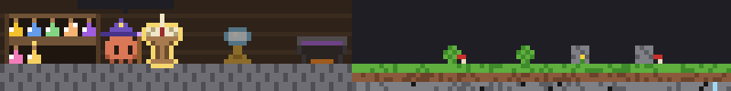

**Düzenlerken:** kazanda iksir

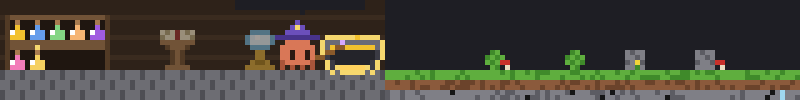

**İksir dolaba:** şişe Clawd'un elinden rafına uçar

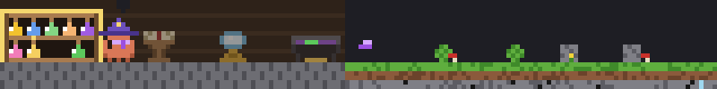

**Bash:** fitil ve patlama

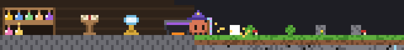
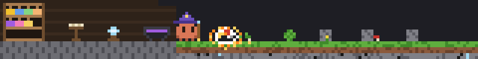

**Alt ajan:** portaldan çıraklar

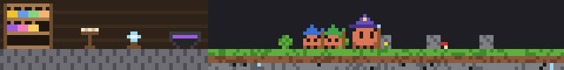

**Hata:** creeper

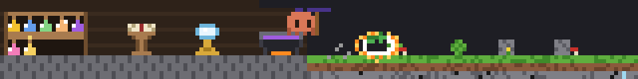

**Tur bitti:** kutlama

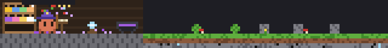

### Ayrıntılar

- **Şişe renkleri** dosya türünden gelir: `.js`/`.ts` sarı, `.md` mavi, `.py` yeşil, `.json` turuncu, `.css`/`.html` pembe, diğerleri mor.
- **Malzeme:** düşünürken toplananlar bir sonraki şişeyi parlatır; yeterince malzemeyle dolan şişe rafta pırıldar.
- **Kullanılan eşya parlar:** kürsü, küre ya da kazan kullanılırken çevresinde sarı bir hale yanıp söner, diğerleri sönükleşir.
- **Işınlanma:** Clawd laba 8 bloktan uzaktaysa yürümez, mor parçacıklarla ışınlanır.
- **Reddedilen araç:** izin vermediğin bir çağrı ceza sayılmaz; iksir oluşmaz, TNT patlamadan söner.
- **Sayaç:** spinner'ın yanında görünür, `· ⚗ 7 iksir · ✦ 12`.
- **Dolap:** 2 raf × 5 şişe görünür; yeni şişe Clawd'un elinden rafına uçar, birkaç saniye yanıp söner ve üstünde yıldızla işaretli kalır.
- **Dar terminal:** bant 110 sütundan darsa lab dolap ve kazana iner. Kısa bantta önce yeraltı kırpılır, balon düğme satırına geçer; Desktop'ta sahne yerine tek satır metin gösterilir.

## Oyna

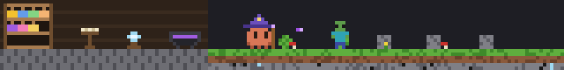

Bandın altında `1: zıpla  2: ←  3: →  4: büyü  5: iksir` şeridi var. İstem boşken bir rakama basarsan
Clawd ~5 saniye senin kontrolünde kalır. `4` baktığı yöne büyü atar. `5` dolaptan bir iksir içer ve kısa süreli
bir etki verir: hız, yüksek zıplama ya da parlama. İçilen iksir dolaptan ve sayaçtan düşer.

## Kurulum

Claude Code **2.1.287** ya da üstü gerekir (`claude update`). Claude Code'un içinde:

```
/plugin marketplace add sOrcerercs/clawd-buyucu
/plugin install clawd-buyucu@clawd-buyucu
```

Yerel bir kopyadan kurmak için: `/plugin marketplace add ~/clawd-buyucu`.

`/buyucu` modu açıp kapatır (tercih saklanır, varsayılan açık).

## Geliştirme

```bash
claude plugin test plugin                    # testler (oturumsuz)
claude plugin validate plugin --strict       # doğrulama
claude --plugin-dir ./plugin                 # modla yeni oturum aç, kaydedince yenilenir
node araclar/onizle.mjs bitti 120            # Claude'suz önizleme (terminalde)
node araclar/ekran.mjs ekran                 # README görsellerini yeniden üret
```

`plugin/hooks/register.js` mods API'sini kullanan tek dosyadır. Sahne (`sahne.js`), çizim (`cizim.js`) ve
diğer modüller saf fonksiyonlardır. Tasarım ve plan `docs/superpowers/` altında.

Claude Code 2.1.289 ile test edildi.
[clawd-madenci](https://github.com/selmakcby/clawd-madenci)'den esinlenildi; kod paylaşılmaz, her şey sıfırdan yazıldı.
